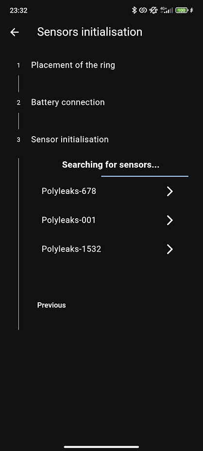

# Polyleaks

Ce projet est une application mobile réalisée en 2024 dans le cadre d'un premier projet d'ingénieur, en deuxième année de Prépa intégrée.

Il s'agit de la partie informatique d'un projet visant à pouvoir détecter des potentielles fuites d'eau dans les canalisations publiques.

# Sommaire
* **[Contexte](#contexte)**
* **[Hardware](#Hardware)**
* **[Application](#Application)**
	* **[Fonctionnement principal](#fonctionnement-principal)**
	* **[Écran "Historique"](#ecran-historique)**
	* **[Écran "Plus"](#ecran-plus)**
* **[Notes](#notes)**
* **[Crédits](#Crédits)**

# Contexte
Les fuites d'eau représentent un problème considérable en France, mais aussi à l'échelle mondiale. En effet, on estime actuellement que les rendements des canalisations en France sont de 81%, ce qui signifie que 19% des eaux en France sont perdues. Au-delà des problèmes environnementaux que cela peut produire, le prélèvement, la potabilisation, le stockage et l'acheminement de cette eau requiert des dépenses énergétiques, dont une partie sera utilisée pour de l'eau qui n'arrivera finalement jamais jusqu'au consommateur. 

À l'ère de la transition écologique dans laquelle nous sommes, économiser et utiliser raisonnablement l'énergie et les ressources telles que l'eau sont des enjeux sociétaux majeurs. Notre projet répond alors à 3 des Objectifs de Développement Durable de l'ONU:
<!-- afficher les image des odd dans une ligne équitablement répartie -->
<!-- flexbox -->

# Hardware
<table>
	<tr>
		<td width=150px>
			
		</td>
		<td>
			

				La partie de l'équipe ayant travaillé sur l'objet physique du projet a confectionné un débitmètre à effet Hall. C'est en fait un ensemble de pièces imprimées en 3D, composé d'une turbine dont la rotation entraîne un aimant qui est détecté par le capteur à effet Hall.
			

			

				Un compartiment électronique permet d'y placer une batterie et un Raspberry Pi Pico WH, qui se chargera de récupérer les données du capteur et de les envoyer à l'application mobile.
			

		</td>
	</tr>
</table>
Chaque capteur est en mesure de communiquer avec l'application via Bluetooth Low Energy (BLE). Voici ci-dessous la structure du serveur GATT de chaque capteur :

# Application

## fonctionnement principal

Toute l’application se base autour d’une fonctionnalité principale, la comparaison des mesures de deux capteurs, fonctionnalité que l’on retrouve donc sur l’écran d’accueil, disponible dès l’ouverture de l’application. L’application est en effet capable de gérer jusqu’à deux connexions BLE simultanées. Dès son ouverture, elle scanne de manière autonome les appareils à proximité et propose à l’utilisateur de se connecter aux Polyleaks disponibles. On y voit alors la mesure de chaque capteur en direct et une animation ainsi qu’un message nous indique s’il y a une fuite dans la section observée.

Au-delà de ce minimum vital, j'ai également fait en sorte que l’application soit la plus intelligente possible, elle est alors robuste aux déconnexions imprévues, passant l’emplacement du capteur en “Vu, il y a ...”. Cela est particulièrement pratique lorsque l’on doit se déplacer de plus d’une dizaine de mètres pour atteindre l’autre bout de la section : le premier capteur est naturellement perdu de vue, mais la dernière valeur qu’il aura transmise restera affichée à l’écran. De plus, l’application est aussi capable de se reconnecter automatiquement à ce capteur dès qu’il est de nouveau dans la portée du téléphone et possède une gestion complète de l’obtention des autorisations nécessaires à un scan Bluetooth, étant alors en mesure de donner les bonnes explications à l’utilisateur lorsque quelque chose ne va pas.

Enfin, depuis différents menus et notamment depuis l’écran d’accueil, l’utilisateur peut afficher toutes les informations d’un capteur, que sont sa position GPS, la date de sa dernière connexion à l’application, la date de son initialisation ainsi que son niveau de batterie.

## Ecran "Historique"

Par la suite, pour tirer parti des possibilités offertes par le développement d’une application, j'ai imaginé plusieurs fonctionnalités annexes. Ainsi, sur le deuxième menu “Historique” de l’application, l’utilisateur va pouvoir retrouver de deux manières différentes les capteurs qu’il aura scannés auparavant. D’une part, l’application peut afficher les capteurs sauvegardés sur une carte, et d’une autre part, elle peut les afficher sous la forme d’une liste pouvant être triée de six manières différentes. J'ai essayé d'implémenter des interfaces minimalistes et compréhensibles au premier coup d’œil, pour proposer une expérience utilisateur fluide et intuitive. 

À noter que depuis le menu “Historique”, lorsque l’utilisateur affiche les détails d’un capteur, l’application lui propose une nouvelle fonctionnalité, celle de pouvoir placer dans le comparateur de l’écran d’accueil les capteurs qu’il souhaite. C’est-à-dire que de la même manière qu’avec une connexion GSM, l’utilisateur peut vérifier à distance les sections qu’il souhaite, à la différence près que ce seront les dernières valeurs transmises par communication BLE qui seront utilisées pour la comparaison. Ainsi, après avoir “placé” dans chaque emplacement les capteurs de son choix, en retournant sur l’écran d’accueil, l’utilisateur verra apparaître ses deux capteurs sélectionnés avec la mention “Vu il y a ...” et le point orange.

## Ecran "Plus"

Pour finir, l’application dispose d’un dernier menu, “Plus” qui regroupe quelques fonctionnalités supplémentaires. L’utilisateur peut y choisir le langage de l’application, entre Français et Anglais, et cette dernière est compatible avec le mode sombre natif du téléphone, plus agréable à regarder si l’application est utilisée dans le noir. Une page “À propos” y est disponible, présentant notre projet dans le contexte du projet scolaire. Enfin, on trouve sur cette page la fonctionnalité permettant d’initialiser un nouveau capteur.

L’initialisation d’un capteur Polyleaks est un concept clé dans l’utilisation de notre produit. En effet, dans l’idée d’une réelle commercialisation, lorsqu’un capteur sort d’usine et est livré au client, il ne connaît de lui que son nom, identifiant unique, et son niveau de batterie. Lorsque l’utilisateur va placer le Polyleaks dans sa tuyauterie, il va alors utiliser l’application pour l’initialiser. À ce moment-là, cette dernière va utiliser les coordonnées GPS du téléphone et les transmettre au capteur, puisqu’elles deviendront sa position définitive. C’est ce processus astucieux qui permettra par la suite à l’application de pouvoir placer sur la carte, un capteur initialisé par quiconque tout en évitant de donner à chaque Polyleaks une puce GPS qui ne servirait qu’une seule fois.

# Notes

J'ai développé cette application en utilisant le framework Flutter, qui la rend donc compatible avec les systèmes d’exploitation Android et iOS. 

Cette application est la première que je réalise. En y découvrant la moindre chose qui compose ce projet (Dart, connexions Bluetooth, API Google Maps ...), il m'aura fallu environ 3 mois pour écrire les +4500 lignes de code qui la composent, en parallèle de mes cours examens et associations étudiantes.

J’ai en fait profité de cette occasion pour réaliser l’application la plus complète possible en essayant de négliger le moins de point, et ce même si cette dernière ne sera finalement utilisée par personne. J'y aurais appris les fondamentaux du développement d’une application, mais également à garnir une application de nombreux détails, pourtant obligatoires pour une utilisation grand public. 

# Crédits
* **[Florian PETIOT](https://github.com/florianpetiot)**